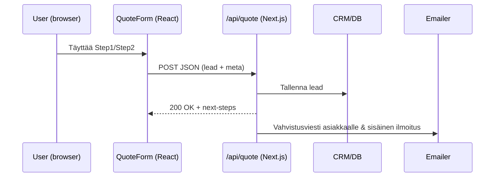

# Suunnitelma (sovitus tähän repo­on)

## 1) Rakenne ja sivukartta

**Nykykansiot:**

* `src/app/(site)/*` – FI-reitit käytössä (etusivu, kotimuutto, yritysmuutto, palvelut, hinnat, yhteystiedot, blog)
* `src/components/*` – valmiit lohkot (HeroArea, Cta, Testimonials, ContactForm, Header/Footer)
* `src/sanity/*` – sisällön hallinta blogille tms.

**Lisättävät reitit & osiot (FI-URLit, EN-polut ohjataan redirecteillä):**

* `/` – Etusivu (hero + miniquote)
* `/kotimuutto`
* `/yritysmuutto`
* `/palvelut` (jakosivu + ankkurit: pakkaus, varastointi, siivous, pianot, nosturit…)
* `/pyyda-tarjous` – **monivaiheinen** tarjouslomake (Step 1 lyhyt, Step 2 lisätiedot)
* `/yritys` (korvaa aiemman suunnitelman `/meista`)
* `/yhteystiedot`
* `/ukk` (alias: `/usein-kysytyt-kysymykset` → redirect)
* `/blog` (FI-nimi "Blogi", alias: `/blogi` → redirect)
* (Poistettu: dynaamiset kaupunkisivut `/toimialueet/[kaupunki]` tässä vaiheessa)
* (Footer: tietosuoja, ehdot, vakuutusinfo)

### Mermaid – sivuston sisällöllinen rakenne

```mermaid
graph TD
  A[/Etusivu "/"] --> B[/Kotimuutto "/kotimuutto"]
  A --> C[/Yritysmuutto "/yritysmuutto"]
  A --> D[/Palvelut "/palvelut"]
  A --> E[/Pyydä tarjous "/pyyda-tarjous"]
  A --> F[/Meistä "/meista"]
  A --> G[/Yhteystiedot "/yhteystiedot"]
   A --> H[/UKK "/ukk"]
   A --> I[/Blogi "/blog"]
  D --> D1[ Pakkaukset ]
  D --> D2[ Varastointi ]
  D --> D3[ Muuttolaatikot ]
   D --> D4[ Siivous ]
  B --> E
  C --> E
  D1 --> E
  D2 --> E
```

## 2) Etusivu (Hero + trust + CTA)

* **Hero**: kuva/video + arvolupaus (“Nopea, turvallinen ja läpinäkyvä muutto koko Suomessa”) + **ensisijainen CTA**: “Pyydä tarjous”.
* **Mini-quote Step 1** (3–5 kenttää): nimi, puhelin/email, “Mistä → minne (postinumero)”, asunnon koko.
* **Miksi valita meidät**: 4–6 pointtia (vakuutettu, 4.9/5 arviot, SMPY-jäsenyys, ei piilokuluja, ekologiset laatikot).
* **Palvelukortit** kahdelle segmentille (Kotimuutto / Yritysmuutto).
* **Testimoniaalit** + logo/sertifikaattibadgetit.
* **Toissijaiset CTA\:t**: “Varaa maksuton kartoitus”.

**Repo-kohdat:**

* Lisää/viilaa `src/components/HeroArea/*` (call to action näkyviin).
* Lisää **mini-quote** komponentti `src/components/Forms/QuickQuote.tsx` ja upota etusivun `page.tsx`:iin.
* Hyödynnä `components/Testimonials/*`; lisää skeema Sanityyn (ks. kohta 5).

## 3) Palvelusivut (kotimuutto / yritysmuutto)

* **Yläosa**: kohderyhmän kipupisteet + kuva.
* **Sisältö**: “Mitä sisältyy” (pisteinä), prosessi 1–5 (Lomake → Kartoitus → Tarjous → Muuttopäivä → Jälkihoito).
* **CTA** joka foldin jälkeen.
* **Kotimuutto**: TODO
* **Yritysmuutto**: TODO

**Repo-kohdat:**

* Täydennä `src/app/(site)/services/residential-moves/page.tsx` ja `.../business-moves/page.tsx`
  käyttäen valmiita lohkoja `SmallFeatures`, `Process`, `Cta`.

## 4) Tarjousfunneli ja lomakkeet

* **Step 1 (nopea)**: nimi, yhteystieto, mistä→minne, kohteen koko, muuttopäivä (valinnainen).
* **Step 2 (valinnainen)**: lisäpalvelut (pakkaus, siivous), inventaario (vapaateksti tai checkboxit), hissi/etäisyys, lisähuomiot.
* Kiitos-sivu + **kutsu**: varaa 15 min **videokartoitus** (Calendly/tms.) **tai** WhatsApp-nappi.

**Tekniikka:**

* Luo `src/app/(site)/pyyda-tarjous/page.tsx`
* Tee `src/components/Forms/QuoteForm/Step1.tsx` ja `Step2.tsx` (+ `Progress.tsx`)
* Lähetys: API-reitti `src/app/api/quote/route.ts` → tallenna CRM:ään tai Sanityyn / lähetä maili
* Näytä lupateksti + linkki tietosuojakäytäntöön (GDPR)

### Mermaid – konversiofunneli

```mermaid
flowchart LR
  V[Saapuu etusivulle] --> H{Hero CTA}
  H -->|Täyttää Mini-Quote| S1[Step 1: Perustiedot]
  S1 -->|Onnistui| TY[Kiitos + seuraavat askeleet]
  TY --> S2[Step 2: Lisätiedot (valinn.)]
  TY --> BK[Kalenterista kartoitus]
  TY --> WA[WhatsApp / Soita]
  S2 --> SUB[Submit -> CRM/Email]
  BK --> SUB
  WA --> SUB
  SUB --> SALES[Myyjä: tarkentava soitto / tarjous]
  SALES --> BOOK[Ajovarauksen vahvistus]
```

### Mermaid – lomakkeen datavirta (frontend → API → varaus)



## 5) Sisällönhallinta (Sanity)

Lisää skeemat: **Services, Testimonials, PriceExamples, Locations** (kaupunki­sivut), **Badges/Certificates**.
Nykykansiot: `src/sanity/schemas/*` ja utilit.

**Toimet:**

* `service.ts`: kentät (otsikko, ingressi, kohderyhmä, ikonit, “sisältyy”-lista, FAQ-ankkurit)
* `testimonial.ts` (jo löytyy): lisää `rating`, `segment` (B2C/B2B)
* `price.ts`: **esimerkkihinnat** (tyyppi, kuvaus, €-haarukka, sisältyy-teksti)
* `location.ts`: kaupunki, metasisällöt, CTA-puhelin

Sitten: hae sivuilla `getServices() / getTestimonials()` (katso `sanity-utils.ts`), renderöi staattisesti + revalidate.

## 6) Hinnoittelu & esimerkit

* Luo **hintaesimerkki-komponentti** (kortit) ja upota `/kotimuutto` & `/yritysmuutto`.
* Selitä hinnoitteluperiaatteet (tunti vs. kiinteä, kuljetus, vakuutukset, ALV, ei piilokuluja).
* Lisää **“Varaa maksuton kartoitus”** CTA jokaisen esimerkkilohkon jälkeen.

## 7) Toimialueet ja SEO

* Dynaaminen reitti `src/app/(site)/toimialueet/[city]/page.tsx`
* Kaupunkikohtainen kopio + NAP-tiedot; sisäiset linkit palveluihin.
* **Tekniset**: meta-tags, Open Graph, `robots.txt`, `sitemap.xml`, strukturoitu data (LocalBusiness, FAQ).
* Performance: kuvien optimointi (`next/image`), lomakkeen lazy import, CSS kriittinen polku (nykyinen `style.css` ok, tarkista).

## 8) Luottamuselementit

* SMPY/ISO-badges komponentiksi (`components/Badges/*`), sijoitus etusivulle & footerin yläpuolelle.
* Google-arviot (manuaaliset nosto­lainaukset tai widget), **asiakaslogot** B2B-sivulle.
* Selkeä **vakuutus & tietoturva** -teksti tarjous- ja yhteyssivuilla.

## 9) Analytiikka & mittarit

* Tapahtumat: `quote_start`, `quote_submit`, `book_survey_click`, `whatsapp_click`.
* Konversiopolkuanalyysi (GA4/Matomo).
* A/B: CTA-tekstit (“Pyydä tarjous” vs. “Saa hinta-arvio nopeasti”).

---

# Koodin analyysi → konkreettiset muutokset

**Havaintoja:**

* App Router: `src/app/(site)/…` – helppo lisätä uusia sivuja.
* Komponenttikirjasto: `HeroArea`, `Cta`, `SmallFeatures`, `Testimonials`, `ContactForm` → lohkoja löytyy.
* Sanity on jo integroituna (`sanity-utils.ts`, `schemas/*`), joten sisältö kannattaa nostaa CMS:ään.
* `Header` sisältää haku- ja session-hookit; lisää pää-CTA napit (quote & call) näkyville.

**Tee nämä:**

1. **Pää-CTA Headeriin**

   * `src/components/Header/index.tsx` → lisää oikeaan laitaan:

   ```tsx
   <Link href="/pyyda-tarjous" className="btn btn-primary">Pyydä tarjous</Link>
   <a href="tel:+358xxxxxxxxx" className="btn btn-outline">Soita</a>
   ```
2. **Mini-quote Heroon**

   * Luo `components/Forms/QuickQuote.tsx` (Step 1).
   * Upota `src/app/(site)/page.tsx`:iin Hero-lohkon alle.
3. **Täysi tarjouslomake**

   * Luo `src/app/(site)/pyyda-tarjous/page.tsx`
   * Kansiot: `components/Forms/QuoteForm/{Step1.tsx, Step2.tsx, Progress.tsx, index.tsx}`
   * API: `src/app/api/quote/route.ts` (POST) → tallenna Sanityyn tai lähetä sähköposti.
4. **Sanity-skeemat**

   * Lisää `services.ts`, `priceExample.ts`, `badge.ts`, `location.ts`
   * Päivitä `schemas/index.ts`
   * Hae sisällöt `sanity-utils.ts` funktioilla palvelusivuilla.
5. **Kaupunkisivut**

   * `src/app/(site)/toimialueet/[city]/page.tsx`
     `generateStaticParams()` → `["helsinki","tampere","turku",…]`
6. **FAQ-komponentti** (Accordion)

   * `components/FAQ/*` ja sisäänsyöttö Sanitystä.
7. **Esimerkkihinnat-komponentti**

   * `components/Pricing/PriceExamples.tsx` (kortit, range, “sisältyy” lista).

---

# Pika-”tehtävälista”

* [ ] Header CTA\:t
* [ ] Hero + Mini-quote (Step 1)
* [ ] `/pyyda-tarjous` Step 1–2 + API
* [ ] Sanity-skeemat: Services, Testimonials (laajenna), PriceExamples, Locations, Badges
* [ ] Palvelusivujen tekstit + hintaesimerkit
* [ ] Toimialueet dynaamisesti
* [ ] FAQ + Yhteystiedot (WhatsApp + tel: linkit)
* [ ] SEO (title/desc, schema.org, sitemap)
* [ ] Analytiikkaeventit

---

Haluatko, että teen seuraavaksi **tarjouslomakkeen rungon** (Step1/Step2 + API-reitti) tähän koodipohjaan valmiiksi—vai rakennetaanko ensin Sanity-skeemat (Services/PriceExamples), jotta sisältö saadaan CMS\:stä suoraan sivuille? Yksi valinta kerrallaan 😊
