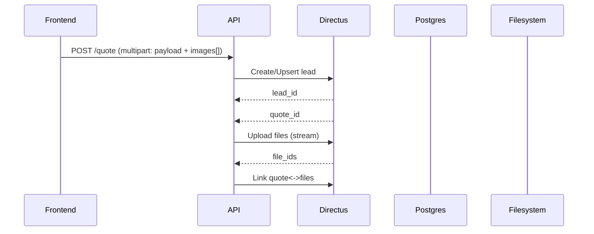

Here’s a single handover doc you can give the next agent: what’s built, the target self-hosted architecture, how services connect, and how to evolve it. I’ve also listed options to auto-generate diagrams/docs so we don’t write things twice.

## What’s ready now

- Public app
  - Next.js app with a new page at `/tarjouspyynto` (quote funnel).
  - Multi-step form matches your spec: phone+date required, date flexibility tabs (+/-3/+/-7), business toggle with Y-tunnus, extra info fields, image uploads with previews.
  - QuickQuote redirect updated to `/tarjouspyynto`.

- API
  - `/api/quote` accepts multipart: JSON payload + images; validates phone/date; returns `{ ok: true }`. No persistence yet (awaiting DB/CRM).

- Config
  - `siteConfig` currently hardcoded in site.ts; plan to move to Directus “configs” collection.

- Docs
  - v2.md added with a phased self-host migration plan (Postgres + Directus; keep Sanity for blog).

- Build status
  - `npm run build` completed successfully (Exit Code 0).


## Target architecture

- Goals
  - Self-host Postgres and Directus.
  - Use Supabase-hosted Postgres and self-host Directus.

- muuttokone.fi
  - Next.js frontend (public site), fetches config/content from API/Directus, renders pages and quote funnel.

- api.muuttokone.fi
  - Node API (NestJS/Express or extend Next API). Handles quote submission, file handling, integration to Directus (or DB direct).

- mgmt.muuttokone.fi
  - Directus admin. Manage configs, leads, quotes, files, activities, users/roles.

- crm.muuttokone.fi (optional; Plan B)
  - Custom CRM if Directus is not enough (can reuse NextAdmin Pro template you mentioned).

### High-level view

```mermaid
graph TD
  A[Internet] --> CF[Cloudflare DNS/Proxy or Tunnel]
  CF --> RP[Traefik or Caddy\nReverse Proxy + TLS]

  subgraph Home Server (Docker)
    RP -->|muuttokone.fi| FE[Next.js Frontend]
    RP -->|api.muuttokone.fi| API[Node API (NestJS/Express or Next API)]
    RP -->|mgmt.muuttokone.fi| ADMIN[Directus Admin]
    RP -. optional .->|crm.muuttokone.fi| CRM[Custom CRM (NextAdmin Pro)]

    API --> PG[(PostgreSQL)]
    ADMIN --> PG
  - Supabase Postgres instance (managed, with automatic backups)
    API --> FS

    FE -. SSR fetch .-> API
    FE -. blog .-> SANITY[(Sanity)]
  end
- No Redis/cache initially.
- File storage defaults to filesystem via Directus (simplest). If you prefer DB-only, store attachments as `bytea` and serve via API.

## How services connect

### Config flow (siteConfig)

- Admin edits keys in Directus collection `configs` (key: string, value: JSON).
- Frontend server code fetches config via API (either proxy to Directus or direct call) and maps to the shape currently in site.ts.
- Optional feature flag to fall back to local config if Directus is down.

Sequence:

```mermaid
sequenceDiagram
  participant Admin as Admin UI (Directus)
  participant Directus as Directus API
  participant FE as Frontend (Next.js)
  FE->>API: GET /config?keys=brand,contact
  API->>Directus: GET /items/configs?filter[key][_in]=brand,contact
  Directus-->>API: { data: [ ... ] }
```

### Quote submission flow

- Frontend submits multipart form with JSON payload + images to `api.muuttokone.fi/quote`.
- API validates and writes:
  - Create/lookup lead (phone unique-ish).
  - Create quote record with details (size, date, flex, etc.).
  - Save files: upload to Directus files (or to filesystem/db), link to quote.
- API returns `{ ok: true, id: <quote_id> }`.



If using DB `bytea` for attachments:
- Replace Directus uploads with `INSERT INTO attachments (quote_id, filename, mime, size, data) VALUES ...`.
- Serve `GET /files/:id` to stream bytes with Content-Type/Disposition.


- configs: key (PK), value (JSON)
- leads: id, created_at, name, phone (required), email, is_business, business_id, notes
- quotes: id, lead_id (rel), from_zip, to_zip, size, date, date_flex, elevator, distance, services (json/csv), inventory, address_from_extra, address_to_extra, contact_notes, status
- files: Directus built-in file library (id, filename, mime, size, storage path)
- quote_files: m2m (quote <-> files)
- activities: id, lead_id (rel), type, content, at, by

Optional if DB-stored attachments:
- attachments: id, quote_id, filename, mime, size, data bytea, created_at

## Environments and secrets
- Frontend
  - NEXT_PUBLIC_SITE_URL
  - API_BASE_URL (https://api.muuttokone.fi)
  - SANITY project vars (unchanged for blog)

- API
  - DATABASE_URL (Postgres)
  - DIRECTUS_URL (https://mgmt.muuttokone.fi)
  - FILE_STORAGE_MODE (directus|db|fs) — choose strategy
  - MAX_UPLOAD_SIZE_MB, MAX_FILE_COUNT (guardrails)

- Directus
  - DB credentials (same Postgres)

## Home server layout and first run (conceptual)
  - `muuttokone.fi` — Next.js app container and config
  - `api.muuttokone.fi` — API container and config
  - `crm.muuttokone.fi` — reserved for future custom CRM

- Shared infra:
  - Reverse proxy (Traefik/Caddy) with routes:
    - mgmt.muuttokone.fi → Directus
    - crm.muuttokone.fi → CRM (optional)

- Networking:
## Security and policies


---

See also: [v2.md](./v2.md) for the detailed migration plan and phase breakdown.
- Only reverse proxy is public; others on internal network.
- Enable HTTPS and HSTS in proxy.
- Issue a Directus static token with minimal scope for API server-side calls.
- CORS: allow FE origin for API and Directus if called directly from FE (prefer server-side fetching when possible).
- File size limits and MIME checks on upload.
- Backups: nightly `pg_dump` and tar the Directus uploads volume.

## What the next agent needs to do

1) Infra
- Set up Traefik/Caddy with routes and Let’s Encrypt.
- Spin up Postgres, create `app` and `directus` DB users.
- Spin up Directus and initialize admin, storage path.

2) Directus modeling
- Create collections: configs, leads, quotes, quote_files (m2m), activities.
- Configure roles and permissions.

3) API integration
- Extend `/api/quote` to persist:
  - Upsert lead by phone.
  - Create quote.
  - Upload images → Directus files (or DB `bytea`).
  - Link files to quote.
- Optional: Add `GET /config` to map Directus configs to FE shape.
- Optional: Add `GET /files/:id` if using DB-attachments.

4) Frontend updates
- If calling Directus directly for config, add fetch logic on the server; else call API config.
- Add a simple “Kiitos” page or keep toast-only (current behavior is toast).

5) Ops
- Implement backups (DB and uploads).
- Minimal logs retention and basic health checks.

## Auto-generating docs/diagrams (recommended)

- Architecture diagrams
  - Mermaid in Markdown (what we used here). Use Mermaid CLI to export PNG/SVG from `.md`.
  - Structurizr Lite (self-hostable) with C4 model; export diagrams as PNG/SVG.
  - C4-PlantUML via Kroki (render PlantUML server-side in Markdown).

- API docs
  - OpenAPI (Swagger) for API; generate with NestJS Swagger or tsoa (Express).
  - Redocly to render beautiful static API docs from OpenAPI.

- DB schema diagrams
  - Prisma ERD generator (if schema uses Prisma).
  - dbdiagram.io / DBML; commit the `.dbml` and export SVG.

- Directus auto-docs
  - Directus provides interactive API docs for collections; capture and link.

- Site docs
  - Docusaurus or MkDocs to host all docs; embed Mermaid and auto-build in CI.

Tip: Keep diagrams as code (Mermaid/C4/DBML) in the repo so they’re diffable and CI can auto-render to images for the docs site.

## Quick reference (service map)

- Public: muuttokone.fi → Next.js
- API: api.muuttokone.fi → Node API
- Admin: mgmt.muuttokone.fi → Directus
- Optional CRM: crm.muuttokone.fi → custom app
- Data: Postgres (single instance)
- Files: Directus filesystem (default) or DB `bytea` via API
- Blog: Sanity (unchanged)

If you want, I can turn this into a versioned docs starter (MkDocs + Mermaid + a minimal OpenAPI stub) for the next agent to maintain.
